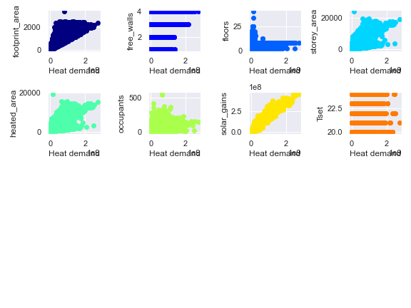

# Digital Twin Munich

Model the city of Munich with a data-driven digital twin. The modelling is based on techniques like Sankey diagramms, scatter plots, clustering graphs, map visualisations and regression curves. 

 
## Data Collection

Most of the data is collected from the GENESIS database of the Bavarian institute of statistics: https://www.statistikdaten.bayern.de/genesis/online/logon . Geo-data of Munich's buildings is from the TUM LNS chair. However, the data collection is being constantly updated.

## Sankey Diagramm
When trying to understand the functioning of a city from an energy perspective, it is important to know the incoming, ongoing and outgoing energy flows of the city. Our approach focuses on primary flows of energy, such as oil or gas. To understand, where in the city which kind of primary energy is consumed. Three main sectors can be identified: Industry, Transportation, and Households. Those sSectors can be further subdivided, for example, by industrial activity (chemical industry, metal processing) or types of transportation (cars, trucks).

**Corresponding .py file**: sankey_munich.py
## Sector Analysis
This section provides an exploratory data analysis on the three main sectors defined: transport, households and industry. In addition, Munich's air quality metrics are examined. The idea behind the analysis is to gain detailed insights into the functioning of the city and possibly identify points that can be optimized in terms of sustainability and circular economy.

**Corresponding .py file**: household_wastes.py; air_quality_v2.py; building_data_analysis.py; industry_materials.py

## Machine Learning
Two machine learning approaches were chosen to analyze the household data. 
Clustering was chosen to find patterns of household densities in Munich to estimate regions with higher energy and material demand. A well-known unsupervised algorithm is k-Means, which can be viewed as an iterative non-convex optimization process for finding cluster centers based on mean calculations. We used the Elbow method to choose the optimal number of clusters, through which k-Means was initialized with (k=5) and visualized it on a geospatial scattermap. Another machine learning approach for the household data analysis was Regression for the estimation of household heat demand. Two supervised algorithms were implemented: a  multivariate linear regression and the XGBoost, which can be seen as a tree boosting algorithm. Before regression training was possible, the predictor variables needed to be defined, a process also called feature engineering. An effective heuristic for the choice of features is a scatter plot matrix, which depicts the relation of each predictor with the target variable:

 It becomes clear that the variables footprint area (area of the base of the building), the number of free walls, storey area (floor area * floors), the solar gains of a building and the heated area have a linear relationship with the heat demand and can be chosen as predictor variables. 
The train and test data were split in a 70:30 ratio and used to train both algorithms. The prediction results are shown in the Sector analysis (link). Although both algorithms do not show state-of-the-art results in terms of MSE, we claim that the proposed algorithms can be further inspected by introducing new highly correlated features and hyperparameter tuning of the XGBoost model.

